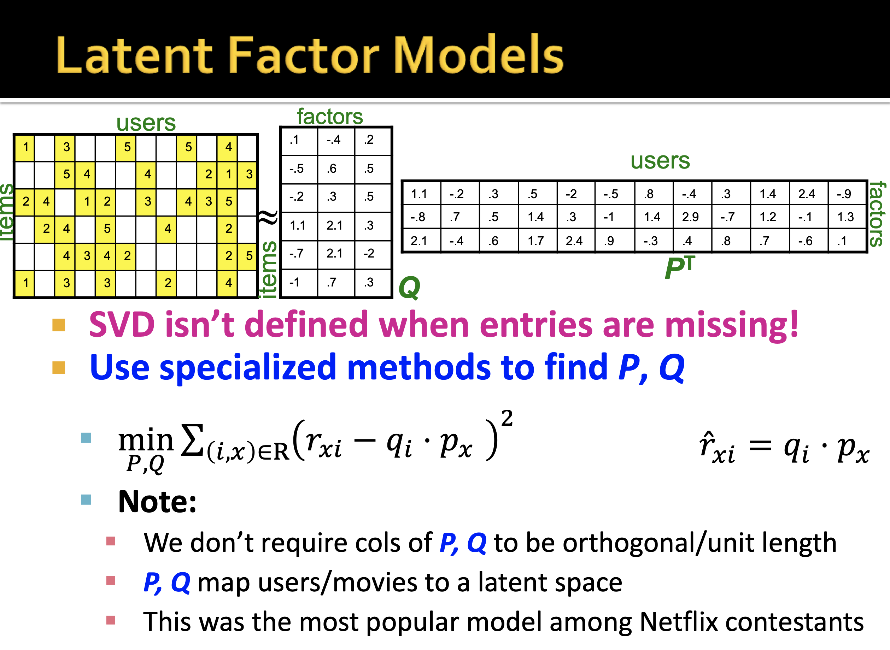

# Recommendation Engine: Latent Factor Model
Instead of computing Singular Value Decomposition, which fits no-user-item-rating as if zero-rating, machine-learn ratings matrix decomposition

References: Jure Lescovec et al, "Mining Massive Datasets"

